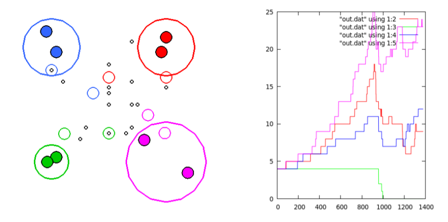

# Bug's Life 🐜

Course: CS 112 (spring semester 2016/2017)

Project: a 2D simulation of anthills competing for food

## Behavior and rules of the simulation

WIP

## Simulation text files format

WIP

## User manual (Linux)

First install the following libraries:

- GLUT: use 'sudo apt-get install freeglut3 freeglut3-dev'
- GLUI: download 'libglui2c2' and 'libglui' (check [here](http://www.rpmseek.com/index.html?hl=com)), then use 'dpkg -i <package name>'.

Then you should be able to compile in folder source using 'make'.

The programme has 4 working modes:

- Error (for grading purposes only)
- Verification (for grading purposes only)
- Graphic (for grading purposes only)
- Final ✔️

'./bugslife.x [Error|Verification|Graphic|Final, F04.txt]

The default mode is Final.

Through the UI you can open a simulation text file, save the current state of the simulation, record the simulation (plots with gnuplots), and control food generation.
