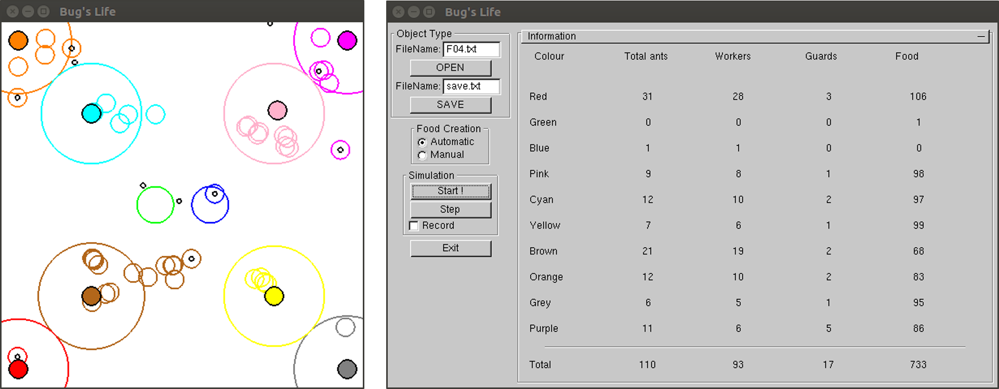

# Bug's Life

Course: EPFL - CS 112 - Programming II (spring semester 2016/2017)

Project: a 2D simulation of anthills competing for food 🐜

Partner: Florian Hartmann

## Behavior and rules of the simulation

- Workers ants are represented by empty small circles ; they seek for food on the map and bring it back to their anthill.
- Guards ants are represented by filled small circles ; they defend their anthill from intruders.
- Anthills are represented by big empty circles ; food is stored at their center ; their size depends on their population and food supplies.
- Food is represented by the tiny black dots.
- Under certain circumstances, workers might attack another anthill to steal its food.
- If two ants from different anthills run into each other, they both die.
- Ants have a limited lifespan.
- Food is generated randomly on the map
- The birth rate of new ants inside an anthill depends on the population and food supply of the anthill.

The detailed rules set for the simulations (behavior of the ants, population evolution, food generation/consumption, anthill size, etc) can be found in `BugsLife_V1.0` (in French).

[comment]: <## Simulation text files format

WIP>

## User manual (Linux)

First install the following libraries:

- GLUT: use `sudo apt-get install freeglut3 freeglut3-dev`
- GLUI: download `libglui2c2` and `libglui` (check [here](http://www.rpmseek.com/index.html?hl=com)), then use `dpkg -i <package name>`.

Then you should be able to compile in source folder using `make`. Many test files are available in the test_files folder. Most of them are meant to trigger a specific error scenario. To get a a working simulation try `F04.txt` or build your own simulation text file! 

The programme has 4 working modes:

- Error (for grading purposes only)
- Verification (for grading purposes only)
- Graphic (for grading purposes only)
- Final ✔️

`./bugslife.x [Error|Verification|Graphic|Final, F04.txt]`

The default mode is Final.

Through the UI you can open a simulation text file, save the current state of the simulation, start/stop the simulation, record the simulation and control food generation. The record files (`.dat`) can be plotted with `gnuplot`: 

`plot "out.dat" using 1:2 with lines,"out.dat" using 1:3 with lines, "out.dat" using 1:4 with lines,"out.dat"`

